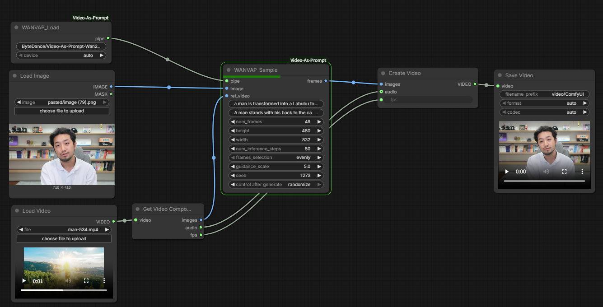

# ComfyUI Video-As-Prompt (WAN)

Big congratulations to the authors of the paper
"Video-As-Prompt: Unified Semantic Control for Video Generation" for their excellent work.
This repository is based on the original ByteDance code
https://github.com/bytedance/Video-As-Prompt and provides ComfyUI custom nodes
to run WAN Video-As-Prompt (VAP).

<p align="center">
  
</p>

## Overview
- `node.py` provides two nodes that load the WAN VAP pipeline and run sampling.
- Model sources can be local folders or Hugging Face repo ids.
- On CUDA, the loader attempts `enable_sequential_cpu_offload()` to reduce memory use.

## Nodes
### WANVAP_Load
Loads and caches the WAN VAP pipeline.
- Inputs
  - `model_id` (STRING): Hugging Face repo id or local path
  - `device` (auto/cuda/cpu): device hint (default: auto)
- Behavior
  - Resolves `model_id` from local folders / ComfyUI model folders / `ckpts`
  - Downloads from Hugging Face if not found locally
  - Reuses the same `model_id` + `device` pipeline from cache
- Output
  - `WANVAP_PIPE`

### WANVAP_Sample
Generates frames from a reference image and reference video frames.
- Inputs
  - `pipe` (WANVAP_PIPE)
  - `image` (IMAGE): reference image
  - `ref_video` (IMAGE): reference video frames batch
  - `prompt` (STRING): text prompt
  - `prompt_mot_ref` (STRING): motion/semantic reference prompts, separated by `|`
- Optional
  - `num_frames` (INT, default 49)
  - `height` (INT, default 480)
  - `width` (INT, default 832)
  - `num_inference_steps` (INT, default 50)
  - `frames_selection` (evenly/first/random)
  - `guidance_scale` (FLOAT, default 5.0)
  - `seed` (INT, default 42)
- Output
  - `frames` (IMAGE): generated frames batch

## Installation
1) Install in ComfyUI `custom_nodes`
```bash
cd <ComfyUI>
cd custom_nodes
git clone https://github.com/<your_name>/ComfyUI-Video-As-Prompt.git
```

2) Install dependencies in your ComfyUI Python environment
```bash
pip install -r requirements.txt
```

3) Prepare the model (choose one)
- Auto-download from Hugging Face
  - Set `model_id` to `ByteDance/Video-As-Prompt-Wan2.1-14B`
- Place locally
  - Put the model in one of the locations below:
    - `ComfyUI/models/video_as_prompt/<model_name>/pretrained_weights/`
    - `ComfyUI/models/video-as-prompt/<model_name>/pretrained_weights/`
    - `ComfyUI/models/Video-As-Prompt/<model_name>/pretrained_weights/`
    - `ComfyUI/models/<model_name>/pretrained_weights/`
    - `ComfyUI/models/ckpts/<model_name>/pretrained_weights/`
  - If `pretrained_weights` does not exist, the folder itself is used.

4) Restart ComfyUI

## Usage
1) Add and connect `WANVAP_Load` and `WANVAP_Sample`.
2) Connect your reference image to `image` and your video frame batch to `ref_video`.
3) Use `|` to separate multiple prompts in `prompt_mot_ref`.
4) The output `frames` is a ComfyUI `IMAGE` batch.

## Notes
- Model folders must include `image_encoder`, `vae`, and `transformer`.
- If you hit memory limits, reduce `num_frames`, `height`, or `width`.
- You can pass a local folder path or folder name as `model_id`.

## Credits
- Original code: https://github.com/bytedance/Video-As-Prompt
- Paper: Video-As-Prompt: Unified Semantic Control for Video Generation
